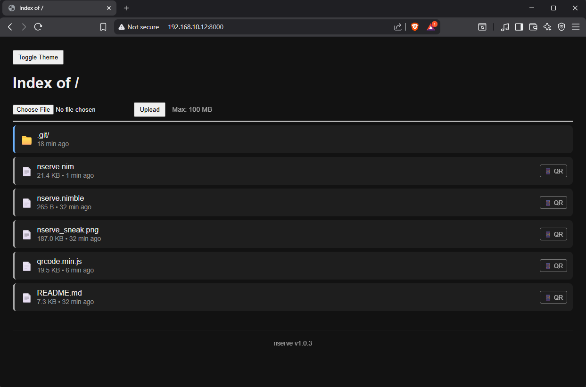
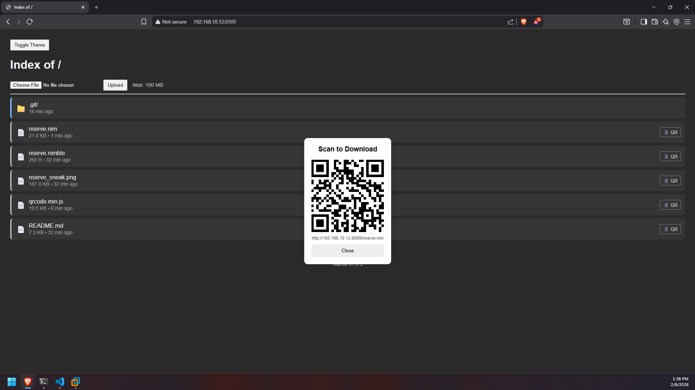

# NServe: A lightweight zero-deps, async HTTP file server with uploads 🚀

> A lightweight, blazingly fast HTTP file server written in Nim with a modern dark/light theme UI and colored request logging. **Zero runtime dependencies** - just a single executable!

| UI Preview | QR Code Feature |
| :---: | :---: |
|  |  |

## Features ✨

- 📁 **Directory Browsing** - Clean, organized listing with folders and files separated
- ⬆️ **Parent Navigation** - Easy navigation back to parent directories
- 📤 **File Upload** - Simple file uploads to any directory
- 🛑 **Upload Limits** - Configurable maximum file size limit (default 100MB) to prevent server overload
- 📱 **QR Code Sharing** - Instant offline QR code generation for sharing files to mobile devices
- 📦 **Directory Zipping** - On-the-fly ZIP archive creation to download entire folders, with instant QR code support for mobile transfer.
- 🎨 **Theme Toggle** - Dark/light mode with persistent preferences using localStorage
- 📊 **Detailed Logging** - Color-coded logs with timestamps and **real client IP/Port tracking**
- 🔧 **Configurable** - Custom host and port via CLI arguments
- 🌐 **MIME Type Detection** - Automatic content-type detection for common file types
- ⚡ **Async/Non-blocking** - Built on Nim's async I/O (`asynchttpserver`) for high performance
- 🎯 **Single Binary** - Compiles to a standalone executable with **zero dependencies**
- 🪶 **Lightweight** - Minimal memory footprint, no external libraries needed

## Installation 📦

### 📥 Download Binaries (No Install Needed)

Don't want to compile? Grab the latest standalone executable for your platform directly from the releases page:

| Platform | Arch | Download Link |
| :--- | :--- | :--- |
| **Windows** | x64 | [**nserve_v1.0.4_windows_amd64.exe**](https://github.com/heckarmon/nserve/releases/download/v1.0.4/nserve_v1.0.4_windows_amd64.exe) |
| **Linux** | x64 | [**nserve_v1.0.4_linux_amd64.elf**](https://github.com/heckarmon/nserve/releases/download/v1.0.4/nserve_v1.0.4_linux_amd64.elf) |

*Just download, give it execution permissions (on Linux `chmod +x`), and run!*

### Via Nimble (Recommended)
Since nserve is published on the official Nim package registry, you can install it with a single command:

```bash
nimble install nserve
```

This will compile nserve and place the binary in your ~/.nimble/bin folder. Make sure that folder is in your system PATH.

### Prerequisites

- [Nim](https://nim-lang.org/install.html) compiler (version 2.0+)

### Build from Source
```bash
# Clone the repository
git clone https://github.com/heckarmon/nserve.git
cd nserve

# Compile the server (creates a single executable)
nim c -d:release nserve.nim

# The resulting binary has zero runtime dependencies!
./nserve
```

## Usage 🛠️

### Basic Usage
```bash
# Start server on default port (8000) and host (0.0.0.0)
./nserve
```

# Or run directly with nim

```bash
nim r nserve.nim
```

You'll see output like:
```
Serving on http://0.0.0.0:8000
Press Ctrl+C to stop

[2026-02-05 12:17:10] 127.0.0.1:59934       GET     200 /
[2026-02-05 12:17:10] 127.0.0.1:59934       GET     404 /favicon.ico
```

### CLI Arguments
```bash
# Custom port
./nserve --port=3000
./nserve -p=3000

# Custom host (e.g., localhost only)
./nserve --host=127.0.0.1
./nserve -h=127.0.0.1

# Combined
./nserve --host=0.0.0.0 --port=8080
```

### Examples
```bash
# Serve current directory on all interfaces, port 8080
./nserve --host=0.0.0.0 --port=8080

# Serve on localhost only, port 3000
./nserve -h=127.0.0.1 -p=3000

# Production build and run
nim c -d:release nserve.nim
./nserve
```

## Request Logging 📊

The server logs all HTTP requests with color-coded output:

- **Methods**:
  - 🟢 `GET` - Green
  - 🟡 `POST` - Yellow
  - 🔵 `PUT` - Blue
  - 🔴 `DELETE` - Red

- **Status Codes**:
  - 🟢 `2xx` - Green (success)
  - 🔵 `3xx` - Cyan (redirect)
  - 🟡 `4xx` - Yellow (client error)
  - 🔴 `5xx` - Red (server error)

## How It Works 🔍

1. **Directory Navigation**: 
   - Navigate to any directory to see its contents
   - Click ⬆️ "Parent Directory" to go up one level
   - Folders are listed first with 📁 icon
   - Files follow with 📄 icon
   - Visual indicators (colored borders) distinguish different types

2. **File Upload**: 
   - Click the "Upload" button on any directory page
   - Select a file from your computer
   - File is uploaded with its original filename
   - Upload is logged in the terminal

3. **Theme Toggle**:
   - Click "Toggle Theme" button to switch between light/dark modes
   - Preference is saved in browser localStorage
   - Persists across page navigation and sessions

4. **File Serving**:
   - Click any file to download/view it
   - Correct MIME types ensure proper browser handling
   - Supports images, videos, PDFs, text files, and more
   - All requests are logged with timestamps

## Supported MIME Types 📋

- **Web**: HTML, CSS, JavaScript, JSON, XML
- **Images**: PNG, JPEG, GIF, SVG, WebP, ICO
- **Documents**: PDF, TXT
- **Media**: MP4, MP3
- **Fonts**: WOFF, WOFF2, TTF
- **Archives**: ZIP
- **Fallback**: `application/octet-stream` for unknown types

## Zero Dependencies 🎯

This server is built using **only Nim's standard library**:
- `asynchttpserver` - Async HTTP server
- `asyncdispatch` - Event loop
- `os` - File system operations
- `strutils` - String utilities
- `uri` - URL encoding/decoding
- `parseopt` - CLI argument parsing
- `times` - Timestamps for logging

**No external packages, no npm, no pip, no cargo - just pure Nim!**

The compiled binary is completely standalone and can run on any compatible system without installing anything else.

## Security Considerations ⚠️

- This server is intended for **local development and testing only**
- Does not include authentication or authorization
- Does not implement HTTPS
- Allows file uploads to any accessible directory
- All requests are logged (helps monitor activity)
- **Do not expose to the public internet without additional security measures**

## Development 🔧

### Project Structure
```
.
├── nserve.nim          # Main server code (~430 lines)
└── README.md          # This file
```

### Building with Optimizations
```bash
# Release build (optimized, smaller binary)
nim c -d:release nserve.nim

# Debug build (with symbols, larger binary)
nim c nserve.nim

# Run without hints
nim --hints=off r nserve.nim

# Cross-compile for different platforms
nim c -d:release --os:windows nserve.nim
nim c -d:release --os:linux nserve.nim
nim c -d:release --os:macosx nserve.nim
```

### Modifying the Code

- **Add MIME types**: Edit the `getMime()` proc
- **Change UI theme**: Modify CSS in `pageTemplate()` proc
- **Customize upload handling**: Edit `handleUpload()` proc
- **Modify logging**: Edit `logRequest()` proc
- **Add features**: Extend `cb()` request callback

## Troubleshooting 🐛

### Common Issues

**Problem**: `Error: invalid integer`
```bash
# Solution: Ensure arguments use = sign
./nserve --port=8080  # ✓ Correct
./nserve --port 8080  # ✗ Wrong
```

**Problem**: Directory shows 404
```bash
# Solution: Ensure URL ends with /
http://localhost:8080/folder/  # ✓ Correct
http://localhost:8080/folder   # ✗ May not work
```

**Problem**: Upload not working
```bash
# Solution: Check directory write permissions
chmod +w /path/to/directory
```

**Problem**: Colors not showing in terminal
```bash
# Some Windows terminals may not support ANSI colors
# Use Windows Terminal or a terminal that supports ANSI escape codes
```

## Performance 📊

Thanks to Nim's compiled nature and async I/O:
- **Fast startup** - Starts in milliseconds
- **Low memory** - Minimal memory footprint (~2-5MB)
- **High throughput** - Non-blocking I/O handles multiple connections efficiently
- **Small binary** - Release builds are typically < 500KB
- **Instant logging** - Colored logs with minimal overhead

## Contributing 🤝

Contributions are welcome! Feel free to:

- Report bugs
- Suggest features
- Submit pull requests
- Improve documentation

## License 📄

MIT License - feel free to use this in your own projects!

## Credits 👏

Built with:
- [Nim Programming Language](https://nim-lang.org/) - Fast, elegant, and compiled
- Nim's standard library only - **zero external dependencies**
- Pure HTML/CSS/JavaScript (no frameworks)

---

**Happy file serving! 🎉**

*Powered by Nim - compile-time efficiency, runtime performance, zero dependencies.*